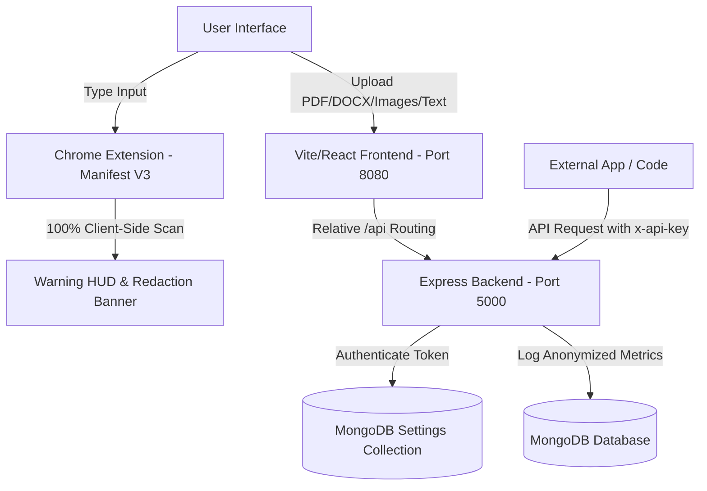

<<<<<<< HEAD
# 🛡️ DataShield AI Ecosystem
A dual-module, local-first privacy platform designed to prevent accidental data leaks to the cloud. It features a real-time **DLP Chrome Extension** that acts as a browser-level input guardrail, and a **Vite/React Web Application** containing a redaction studio, document scanner, secure sharing portal, and public developer API.
=======
# DataShield AI Ecosystem

A dual-module privacy platform designed to prevent the accidental exposure of sensitive data during real-time searching and content sharing.
>>>>>>> 8f08d1b4a5335f9b41e9ad83bb8497a8646f79b6

---

## 🏗️ Architectural Overview
DataShield AI isolates data protection at the client level. Below is the workflow showing how the Chrome Extension blocks leaks at the user's browser, and how the Web App handles secure document auditing and developer requests.



---

## 🛠️ Folder Structure
```
├── src/                    # Chrome Extension source code
│   ├── background/        # Extension background service worker (NLP/Regex Rules)
│   ├── content/           # Content script (DOM MutationObservers & banner rendering)
│   └── popup/             # Extension popup settings UI (Tab controls, sensitivity slider)
│
├── webapp/                 # Full-stack Web Application
│   ├── backend/           # Node.js/Express API (OCR, Redaction controller, API Auth)
│   └── frontend/          # React 18 / Vite Client (Dashboard, Studio, Secure Share)
│
├── docker-compose.yml      # Orchestration for multi-container production build
└── manifest.json           # Chrome Extension Manifest V3 configuration
```

---

## 🚀 Getting Started

You can run DataShield AI either **locally for development** or via **Docker Compose for production**.

### Option A: Running with Docker Compose (Recommended)
This launches the Web App, Node Backend, and MongoDB in fully isolated, configured containers with a single command.

1. **Start the containers:**
   ```bash
   docker compose up --build -d
   ```
2. **Access the Web App:** Open your browser and go to `http://localhost:8080`.
3. **Register/Log In:** Click **Register** on the login screen to create a new admin account.

---

### Option B: Running Locally (Development Mode)

#### 1. Start MongoDB
Ensure MongoDB is running locally on your computer at `mongodb://localhost:27017/`.

#### 2. Start the Backend API
1. Navigate to the backend directory:
   ```bash
   cd webapp/backend
   ```
2. Install dependencies:
   ```bash
   npm install
   ```
3. Run the development server:
   ```bash
   npm run dev
   ```
   *The backend will run on `http://localhost:5000`.*

#### 3. Start the React Frontend
1. Open a new terminal and navigate to the frontend directory:
   ```bash
   cd webapp/frontend
   ```
2. Install dependencies:
   ```bash
   npm install
   ```
3. Run the Vite development server:
   ```bash
   npm run dev
   ```
   *The frontend will run on `http://localhost:5173` (or `5174`).*

---

## 🔌 Chrome Extension: Installation & Guide

The Chrome Extension acts as a real-time **Data Loss Prevention (DLP) guardrail** that intercepts sensitive data before it is submitted to AI models (like ChatGPT, Claude, Gemini) or Search Engines.

### 1. Installation
1. Open Google Chrome and navigate to `chrome://extensions/`.
2. Toggle the **Developer mode** switch in the top-right corner.
3. Click the **Load unpacked** button in the top-left.
4. Select the root folder of this project (the directory containing `manifest.json`).

### 2. How to Test & Use the Extension
1. Open [ChatGPT](https://chatgpt.com), [Claude](https://claude.ai), or [Google Search](https://google.com).
2. Type or paste a sensitive text string into the prompt input box, for example:
   > *"Hey AI, parse this client list: John Doe, email john.doe@email.com, SSN: 666-29-8012"*
3. **The Intercept Banner** will slide into view directly above your input field:
   - **✓ Use Safe Version:** Click this to replace the sensitive inputs in your text field with `[REDACTED]` tokens.
   - **Proceed Anyway:** Logs the event bypass and lets you send the prompt.
   - **✕ Clear:** Wipes the input text field clean instantly.
4. Click the **DataShield AI Extension Icon** in your Chrome toolbar to open the HUD:
   - Toggle the **Sensitivity Profile** slider (Relaxed 🔓 vs Balanced ⚖️ vs Paranoid 🛡️).
   - View the **Security Logs** tab to see a history of blocked data leaks.

---

## 💻 Web App: Features & Guide

The full-stack web application is designed for document auditing, secure compliance checking, sharing, and developer API access.

### 1. Dashboard
- Displays key statistics for scans performed (Total Scans, Average Risk Score, and Clean/High Risk scans).
- Links directly to all tools.

### 2. Content Scanner & Redaction Studio
- **File Uploads:** Ingest files (PDF, DOCX, TXT) or raw images (PNG, JPG). For images, the app automatically executes client-side **Tesseract OCR** to extract text.
- **Redaction Step-by-Step:**
  - **Step 1 (Detect):** Scans the document for sensitive data categories.
  - **Step 2 (Select & Style):** Choose whether to mask items using Black Bars (█), Placeholder tags (e.g. `[EMAIL]`), or Generic redact masks.
  - **Step 3 (Preview):** Review your clean document and download/copy the redacted text.

### 3. Compliance Shield
- Specifically audits text against regulatory patterns:
  - **GDPR:** Flags personal identifiers and contact data.
  - **PCI-DSS:** Flags credit card patterns, account numbers, and routing keys.
  - **HIPAA:** Flags health record patterns and identifiers.

### 4. Secure Share
- Allows you to paste sensitive text and generate a **Self-Destructing Link**.
- Configure link expiration based on **View Count** (e.g. self-destructs after 1 view) or **Expiration Time** (e.g. 1 hour).
- Ideal for sharing credentials or sensitive codes securely over Slack, Teams, or email.

### 5. Developer API Gateway
- Under **Settings**, click **Generate API Key** to provision a token starting with `ss_live_`.
- Developers can programmatically scan text by making `POST` requests to `/api/v1/scan`.
- Authentication is verified in the backend via custom request headers: `x-api-key`.

**cURL Request Example:**
```bash
curl -X POST "http://localhost:8080/api/v1/scan" \
  -H "x-api-key: ss_live_your_key_here" \
  -H "Content-Type: application/json" \
  -d '{"text": "My phone is 555-0199 and email is test@domain.com"}'
```

---

## 🛡️ Privacy Policy & Security Specifications
- **No Raw Data Storage:** The database never stores raw scanned text or uploaded document contents.
- **Anonymized Audits:** The backend only stores metadata logs (e.g., number of characters scanned, risk score, and type of PII categories detected) for chart visualizers.
- **Local Isolation:** All analysis of queries in the Chrome Extension runs locally inside your browser window context. No data is sent to external servers for evaluation.
